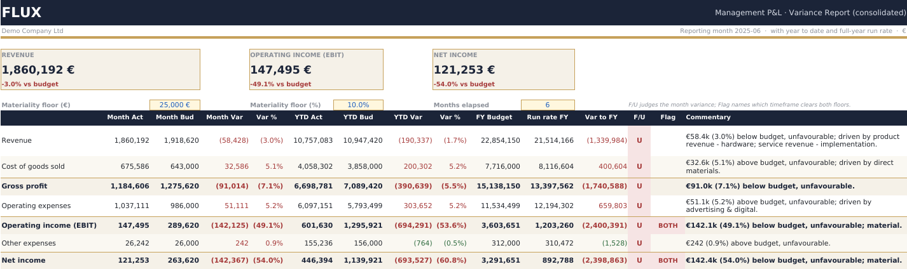
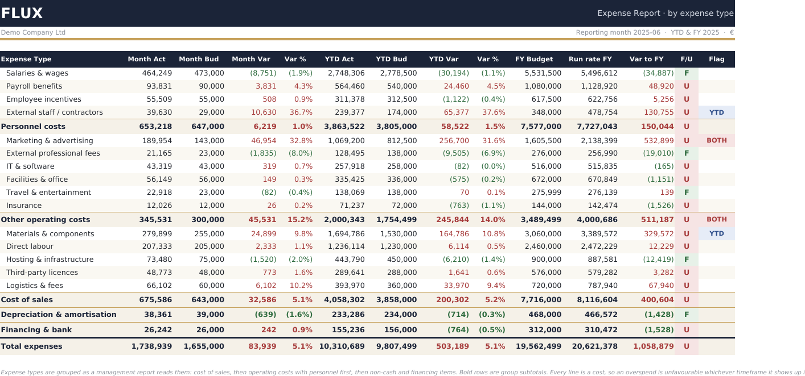
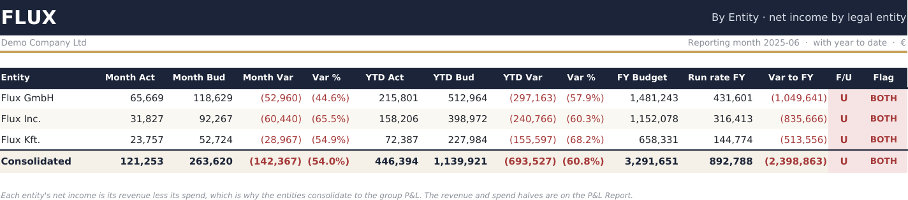
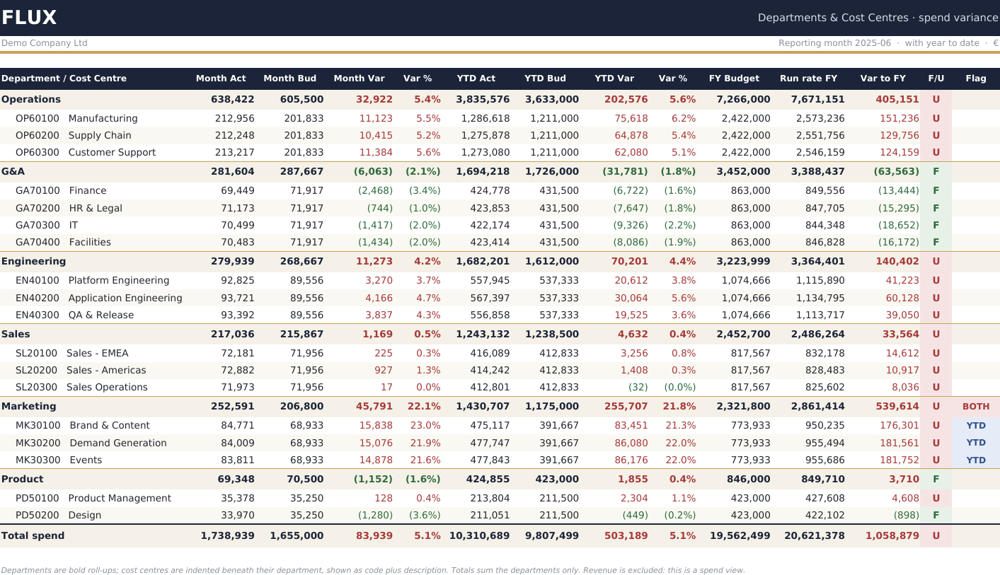
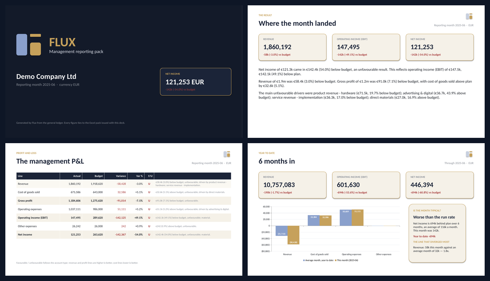

# Flux — FP&A reporting automation

[](https://github.com/benedekpepe/flux/actions/workflows/ci.yml)

**Live demo: https://flux-reporting.streamlit.app/** — open the *Use sample data*
tab to generate the full pack with no sign-up, or upload your own ledger.

A management reporting engine that turns a general ledger into a **management
P&L with variance analysis** — budget and prior-year variances, favourable /
unfavourable classification, materiality flagging, and consolidation by legal
entity, department and cost centre — delivered as a **live Excel pack**, a
**PowerPoint management deck** and a written commentary, behind a Streamlit app.

The name refers to *flux analysis*: the FP&A practice of explaining the movement
between actual results and budget or prior periods. That is the work this engine
automates.

> **Portfolio project.** Built from a controlling background to show the
> reporting logic, not to replace a consolidation system. The demo company and
> its ledger are generated; no client data is included or required.

## Two ways in

- **Upload your own data** — a GL extract or trial balance, optionally with a
  separate budget file. Flux maps the columns, asks you to confirm, and builds
  the pack from whatever dimensions your file actually has.
- **Sample company** — three legal entities in EUR, USD and HUF, transaction-level
  actuals and a full-year budget. Generates the complete pack with no upload.

## What it does

- **Rolls up** leaf accounts to category subtotals and computed subtotals —
  Gross profit, EBIT, Net income — from a single source table.
- **Variances** against budget and prior year, in absolute and percentage terms.
- **Favourable / unfavourable by account type** — revenue and profit lines are
  "higher is better", cost lines are "lower is better", so an overspend never
  reads as good news because the number went up.
- **Two-condition materiality, per timeframe** — an item is flagged only when it
  clears both an absolute EUR floor and a percentage floor, so a 300% variance on
  a €4k line doesn't crowd out the real movers. A near-zero base reads **n/m** and
  is judged on the amount instead. The flag names *which* timeframe cleared both
  floors — **MONTH**, **YTD** or **BOTH** — because a one-off overspend and a
  pattern that has been building all year need different answers.
- **One layout on every sheet** — the month, the year to date, the full-year plan
  and where the run rate lands against it, then F/U and the flag. The sheets
  differ in what they cut the ledger by, never in how they report it, so a reader
  who has learnt the P&L has learnt the pack.
- **Written commentary** per line and for the pack as a whole, generated from the
  actual drivers.
- **Reads real ledger files** — accounting sign conventions, EU and US number
  formats, English and Hungarian headers, debit/credit columns.

## Screenshots

**Management P&L — month, year to date and full-year run rate, with the pack's three lever cells**



**Expense Report — the same columns, cut by expense type**



**By Entity — net income per legal entity, consolidating to the group P&L**



**Departments & Cost Centres — spend roll-up with cost centres nested**



**PowerPoint deck — the same numbers as seven slides, for sending upward**



## How it works

1. **Ingestion** — an arbitrary export is mapped onto the internal schema in
   layers: a synonym dictionary (English + Hungarian), fuzzy header matching,
   content detection from the data itself, and an optional LLM fallback for the
   hard leftovers. The mapping is shown for approval and can be overridden.
2. **Normalisation** — amounts are parsed across accounting sign conventions,
   posting lines are aggregated to account level keeping the analytical
   dimensions, and a credit-balance category is flipped to a positive magnitude.
3. **Engine** — the P&L structure is applied, variances computed, F/U resolved
   from account type, and materiality flagged against the two floors.
4. **Commentary** — the material drivers are turned into a narrative: a headline
   on the bottom line, revenue and gross profit, then the accounts that moved.
5. **Excel pack** — the workbook is written with **live formulas over an input
   sheet**, so an edited input recalculates the whole pack. The sheets that get
   built depend on the dimensions present in the data.
6. **Deck** — the same numbers as seven slides: the result, the P&L, the year to
   date, where the year lands, what moved it, and where the money went. Native PowerPoint charts and
   tables, not images, so the recipient can edit them. The cumulative slide
   compares the month against the average month so far, which is the difference
   between a bad month and a trend; a single-period file drops that slide rather
   than repeat the month under a cumulative heading.
7. **App** — a Streamlit front end for upload, mapping confirmation, preview and
   download of either output.

### The materiality rule

Both floors must be cleared:

| Variance | Amount | Percentage | Material? |
| --- | --- | --- | --- |
| Large amount, small share of a big budget | €30,000 | 3% | No |
| Large share of a tiny budget | €6,000 | 200% | No |
| Clears both | €130,000 | 30% | Yes |
| Near-zero budget | €150,000 | n/m | Yes — judged on the amount |

The test runs twice on every line, once on the month and once on the year to
date, and the flag says which one cleared:

| Flag | Reads as |
| --- | --- |
| **MONTH** | it moved this month, but the year to date is still on plan |
| **YTD** | the month looks fine; the gap has been building since January |
| **BOTH** | material this month *and* cumulatively — look here first |
| *(blank)* | not material on either timeframe |

A single MATERIAL badge could not tell those apart, and the difference is the
difference between a bad month and a trend.

### The lever cells

Three assumptions sit as **editable cells on the P&L sheet**, and every other
sheet points at them rather than holding its own copy:

| Cell | Lever |
| --- | --- |
| `C9` | materiality floor, EUR |
| `G9` | materiality floor, % |
| `K9` | months elapsed, which drives every run rate in the pack |

Change one number and the whole pack re-flags or re-projects. That is enforced by
the test suite, which reads the saved workbook back and checks that each sheet's
flag and run-rate formulas reference the P&L's cells.

## Where the year lands

Every reporting sheet carries the full-year plan and the **run rate** against it:
the year to date ÷ months elapsed × 12, and the gap between that and the budget.
It used to live on a separate *Outlook* sheet, which meant the one question a
reader asks after "how is the month?" was two clicks away from every cut of the
data. Now every line answers it in place.

Months elapsed is the `K9` lever on the P&L, so a reader who disagrees with the
assumption changes one cell and watches the whole pack move.

The deck goes further and shows a second projection beside the run rate:

| Projection | Assumption |
| --- | --- |
| **Run rate** | the rest of the year behaves like the year so far — year to date ÷ months elapsed × 12 |
| **Plan for the rest** | the remaining months hit budget — actual to date + the unspent part of the plan |

The outcome usually sits between them, and the gap is itself the message: it is
the size of what the remaining months have to make up. The workbook carries the
run rate only, because it repeats it on every line of every sheet and a second
projected column on all of them would cost more width than it earns.

Neither is a forecast. There is no seasonality, no pipeline and no assumed
management action — they are arithmetic under a stated assumption, which is what
makes them arguable rather than authoritative.

## Actuals with no budget

A general ledger holds actuals; the plan usually lives in another system. Flux
accepts either shape — one file with both, or a ledger plus a budget export
joined on account code.

**If only actuals are supplied, the variance, F/U and materiality columns are
left empty rather than measured against zero**, and the pack says so. A ledger
compared against nothing would otherwise report every line as a 100% overspend
and flag all of them. The run rate is the exception: it is built from actuals and
the months lever alone, so it still projects. Prior-year actuals are carried on
the GL Input sheet, beside the figures they belong to.

## Reading real ledger files

A real export writes a negative in at least four ways, and getting any of them
wrong either flips the sign or drops the row while the report still looks
finished:

| Written as | Convention |
| --- | --- |
| `-1.234,50` | leading minus |
| `(1.234,50)` | accounting parentheses |
| `1.234,50-` | trailing minus — the SAP default |
| `1,234.50 CR` | credit marker |

EU and US separators are resolved from the rightmost separator, and currency
symbols, currency codes and non-breaking spaces are stripped.

Sign conventions are handled at three levels: **separate debit and credit
columns** are netted; **one amount column plus a D/C marker** is signed from the
marker (SAP `S`/`H`, English `D`/`C` and `DR`/`CR`, Hungarian `T`/`K`); and **a
whole category arriving as a credit balance** — a ledger credits revenue, so
revenue often arrives negative — is normalised and reported. A single credit note
inside an otherwise positive category is real data and is left alone.

Monetary columns are never guessed from an unnamed column: a document number or
a fiscal year must not be read as an amount, so Flux asks rather than assumes.

## The pack adapts to your data

| Sheet | Needs |
| --- | --- |
| P&L Report, Drivers, GL Input | always |
| Expense Report | an expense-type column |
| Departments & Cost Centres | a department column (cost centre nests under it) |
| By Entity | more than one entity |

The department-to-cost-centre hierarchy is read from the uploaded data, not from
a fixed chart of accounts, so a client's own structure is respected. A period
column keeps months apart: the reporting month is the **latest period that
carries postings**, so a full-year budget beside six months of actuals still
reports June. Whichever sheets get built, they all carry the same columns; a
file holding a single period says so on the P&L rather than leaving the reader
to work out why the month and the year to date are identical.

## Commentary

- **Template mode** (default) — pure Python, no API key, no cost. Describes
  magnitude and direction faithfully; it does not invent root causes.
- **LLM mode** (optional) — with `ANTHROPIC_API_KEY` set, the template narrative
  is enriched via the Anthropic API. Any missing key or failure falls back to the
  template, so a public demo never depends on a paid key.

## Tech stack

Python · pandas · NumPy · openpyxl · python-pptx · Streamlit. No heavyweight dependencies: the
reporting logic is plain and fast, and the Excel layer writes formulas rather
than values.

## Project structure

```
flux/
├── app.py                       # Streamlit app: upload -> map -> download
├── src/flux/
│   ├── coa.py                   # chart of accounts, org hierarchy, P&L structure
│   ├── engine.py                # variance engine: P&L, drivers, departments, entities
│   ├── commentary.py            # narrative generation (optional LLM enrichment)
│   ├── ingest.py                # arbitrary client files -> the internal schema
│   ├── synthetic_data.py        # seeded generator for the demo company
│   └── reporting/
│       ├── styling.py           # palette, type, number formats, sheet chrome
│       ├── formulas.py          # formula builders, lever cells, column layout
│       ├── rows.py              # the report row every sheet writes the same way
│       ├── demo_pack.py         # the multi-entity showcase, from generated data
│       ├── client_pack.py       # the pack built from an ingested client file
│       └── pptx_pack.py         # the seven-slide management deck
├── scripts/
│   ├── demo.py                  # console P&L, drivers and commentary
│   └── make_template.py         # builds data/input_template.xlsx
├── tests/audit.py               # end-to-end verification
├── assets/                      # logo and mark (SVG)
├── data/                        # input template
├── docs/                        # screenshots used in this README
└── .github/workflows/ci.yml     # lint, verification, pack build, app smoke test
```

`styling`, `formulas` and `rows` are shared by both packs, so the demo and the
client pack render the same visual language and reach the same materiality
verdict without either importing the other. A sheet supplies only the five
figures it alone can know — the month actual and budget, the year-to-date pair
and the full-year plan — and `rows` writes everything that follows. That is what
stops the two packs reporting the same numbers two different ways, which is
exactly what they had started doing.

The demo chart of accounts covers 41 accounts, 17 expense types, 7 departments,
19 cost centres, 3 legal entities and 3 currencies.

## Getting started

### Prerequisites

- **Python 3.10+**
- No database, no API key, no configuration — the demo generates its own data.

### 1. Create a virtual environment and install dependencies

```bash
python -m venv .venv
source .venv/bin/activate
pip install -r requirements.txt
```

```powershell
# Windows (PowerShell)
python -m venv .venv
.venv\Scripts\Activate.ps1
pip install -r requirements.txt
```

If PowerShell refuses to run the activation script, allow it for the current
terminal only: `Set-ExecutionPolicy -Scope Process -ExecutionPolicy Bypass`.

### 2. Check the install

```bash
python tests/audit.py
```

`PASSED all 172 checks` means everything is wired up correctly.

### 3. Run the app

```bash
streamlit run app.py
```

Open the **Use sample data** tab to see the full pack immediately, or upload your
own GL on the first tab. The hosted version at
[flux-reporting.streamlit.app](https://flux-reporting.streamlit.app/) runs the
same code if you would rather not install anything.

The app follows your system light/dark preference. Both palettes are built from
the same navy, brass and ivory the Excel packs use, so the app and the workbook
read as one product.

## Command line

The engine runs without the app. These entry points add `src` to the import
path themselves, so they work as they are:

```bash
python scripts/demo.py             # console P&L + material drivers
python scripts/make_template.py    # rebuild data/input_template.xlsx
python tests/audit.py              # the verification suite
```

Building a pack straight from the module needs `src` on the import path, since
the package lives under `src/flux/`:

```bash
PYTHONPATH=src python -m flux.reporting.demo_pack      # -> output/flux_demo_pack.xlsx
PYTHONPATH=src python -m flux.reporting.client_pack    # -> output/flux_client_pack.xlsx
PYTHONPATH=src python -m flux.reporting.pptx_pack      # -> output/flux_management_pack.pptx
```

```powershell
# Windows (PowerShell) — set it once per terminal session
$env:PYTHONPATH="src"
python -m flux.reporting.demo_pack
python -m flux.reporting.client_pack
```

Or use it as a library:

```python
from flux import build_report, generate_commentary
from flux.reporting import build_client_pack

report = build_report(gl)                    # gl: account-level DataFrame
print(generate_commentary(report, gl))
build_client_pack(gl, "2025-06", "pack.xlsx")
```

## Tests

```bash
python tests/audit.py
```

**172 checks** covering the P&L arithmetic and roll-up, F/U logic per account
type, the two-condition materiality rule and the not-meaningful escape, number
and period parsing (including all four negative conventions), sign
normalisation, column mapping (including the guard that stops a document number
being read as an amount), aggregation and the proportional budget join,
reporting-period derivation, expense grouping, cross-view reconciliation, the
structure of both generated workbooks and of the deck, the shared column layout,
the actuals-only contract, and edge cases. Exits non-zero on any failure.

Two groups are the load-bearing ones. The **reconciliation** checks: the entity,
department, cost-centre and expense-type views must all tie to the same total as
the P&L, and the P&L must tie to the source transactions. The **layout** checks
read the saved workbooks back and assert that every reporting sheet in both packs
carries the same thirteen columns in the same order, and that its flag and
run-rate formulas point at the P&L's lever cells rather than a local copy — the
drift they catch is invisible in the source, because each sheet builds its own
formulas and any one of them can wander off alone.

They also run automatically on every push and pull request via GitHub Actions
(Python 3.11 and 3.12), together with the linter, an import smoke test, an
end-to-end build of all three packs, and a headless render of the Streamlit app — see
the CI badge at the top. The generated packs are uploaded as a build artifact, so
every green run leaves a downloadable workbook.

## Notes and limitations

- **Not a consolidation system.** There is no intercompany elimination, no
  currency translation adjustment and no journal posting. It reports what the
  ledger says.
- **The commentary describes, it does not diagnose.** It names what moved and by
  how much; it does not claim to know why, because the ledger doesn't say.
- **FX** is applied at the rate carried on each transaction, so the demo shows
  translated EUR alongside local currency but does not model revaluation.
- The synthetic company is seeded and deterministic, which makes the demo stable
  and the tests reproducible — but its variances are generated, not real.

## Roadmap

- [x] Core variance engine with roll-up, F/U logic and materiality flagging.
- [x] Excel export with live formulas and conditional formatting.
- [x] Variance commentary, with optional LLM enrichment.
- [x] Ingestion layer: smart column mapping for arbitrary client files.
- [x] Streamlit app: upload, confirm mapping, download the pack.
- [x] Accounting sign conventions and the actuals-only path.
- [x] Verification suite and CI.
- [x] Public deploy (Streamlit Community Cloud).
- [x] PowerPoint management pack (python-pptx).
- [x] Year-to-date view and a run-rate outlook, in the workbook and the deck.
- [x] One column layout across every reporting sheet, off shared lever cells.
- [ ] Period-over-period trend view, from the periods already in the file.

## License

MIT — see [LICENSE](LICENSE).

## Author

Built by **Péter Benedek** — B.P. Studio
[Portfolio](https://benedekpeter.netlify.app/) · [GitHub](https://github.com/benedekpepe) · [LinkedIn](https://www.linkedin.com/in/benedek-d-peter/)
